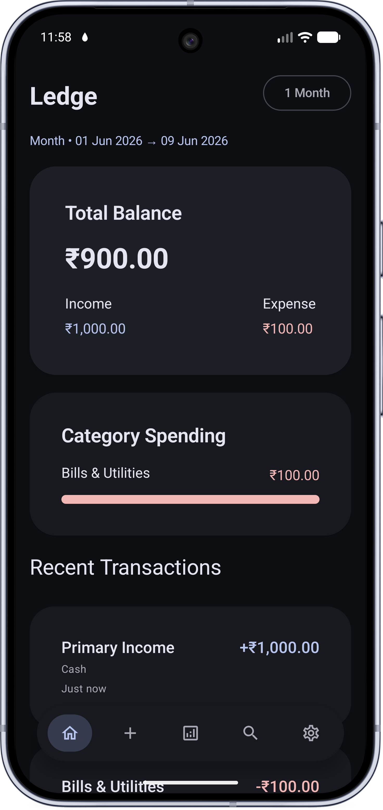
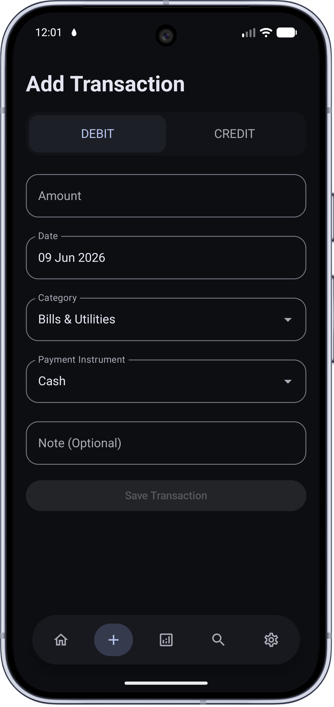
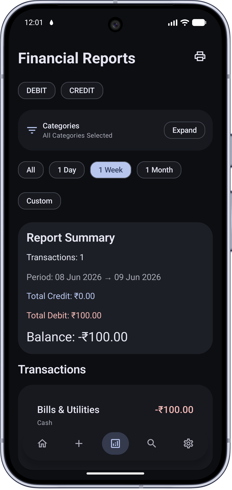
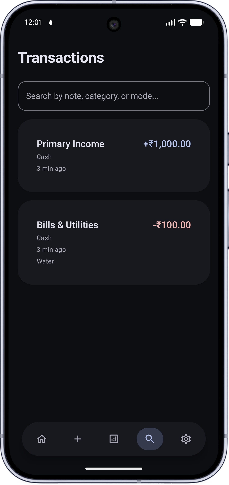
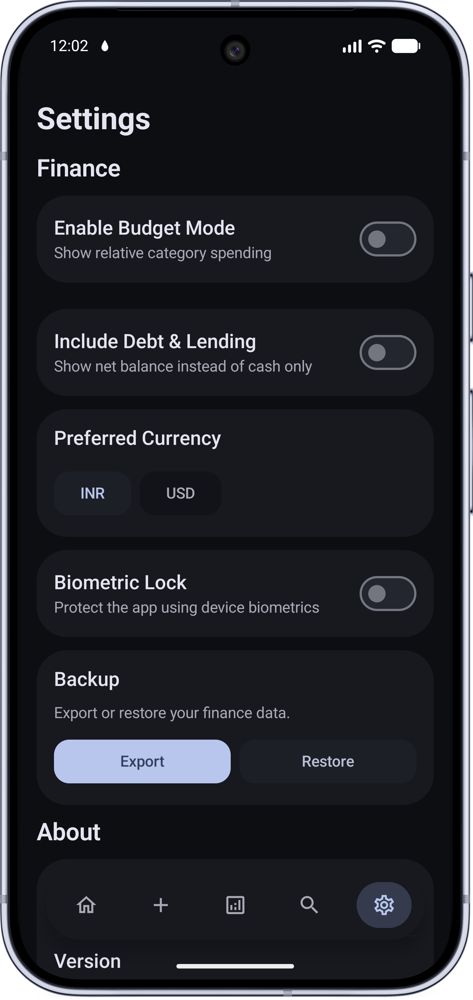

# Ledge

Ledge is a modern Android expense tracking application built with Kotlin, Jetpack Compose, Room, and Hilt.

It helps users manage income, expenses, debt, lending, budgets, reports, and financial analytics with a clean Material 3 UI.

<p align="center">
  
  &nbsp;&nbsp;
   
  &nbsp;&nbsp;
 
 &nbsp;&nbsp;
 
 &nbsp;&nbsp;
 
</p>

[Download](./app/release/app-release.apk)

## Features

* Income and expense tracking
* Debt and lending management
* Monthly budget tracking
* Financial analytics dashboard
* Reports and transaction filtering
* Transaction search with paging
* Backup and restore support
* Multi-currency support
* Biometric lock support
* Material 3 theming
* Offline-first architecture

## Tech Stack

* Kotlin
* Jetpack Compose
* Room Database
* Hilt Dependency Injection
* DataStore Preferences
* Paging 3
* Coroutines and Flow
* Material 3

## Architecture

The project follows a layered architecture:

```text
core/
data/
domain/
ui/
di/
```

### Layers

* `core`
  Utilities, formatters, models, extensions

* `data`
  Room database, DAO, repositories, preferences

* `domain`
  Business logic, use cases, validation, rules

* `ui`
  Compose screens, components, theming

* `di`
  Hilt dependency injection modules

## Database

Ledge uses Room with:

* Indexed transaction tables
* SQL aggregation queries
* Paging support
* Optimized analytics queries

Main entities:

* `TransactionEntity`
* `BudgetEntity`

## Financial Tracking

Supports:

### Income

* Primary Income
* Secondary Income
* Investment Returns
* Repayment Received

### Expenses

* Bills & Utilities
* Food & Groceries
* Transport & Travel
* Health & Personal Care
* Shopping
* Savings
* Debt Repayment
* EMI
* Money Lent

## Analytics

Dashboard includes:

* Total income
* Total expenses
* Outstanding debt
* Lending recovery
* Net balance
* Expense category breakdowns

## Reports

Users can:

* Filter by period
* Filter by category
* Filter by transaction type
* Export printable reports

## Backup

Backup system supports:

* JSON export
* Full restore
* Transactions and budgets backup

## Project Structure

```text
app/
 └── src/main/java/com/ledge
      ├── core
      ├── data
      ├── domain
      ├── ui
      └── di
```

## Build

Requirements:

* Android Studio
* Android SDK
* Kotlin
* Gradle

Clone the project:

```bash
git clone <repository-url>
```

Build the project:

```bash
./gradlew build
```

Run the app:

```bash
./gradlew installDebug
```

## License

This project is for educational and personal use.
